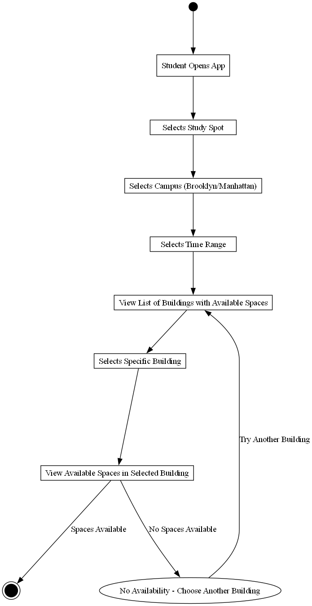
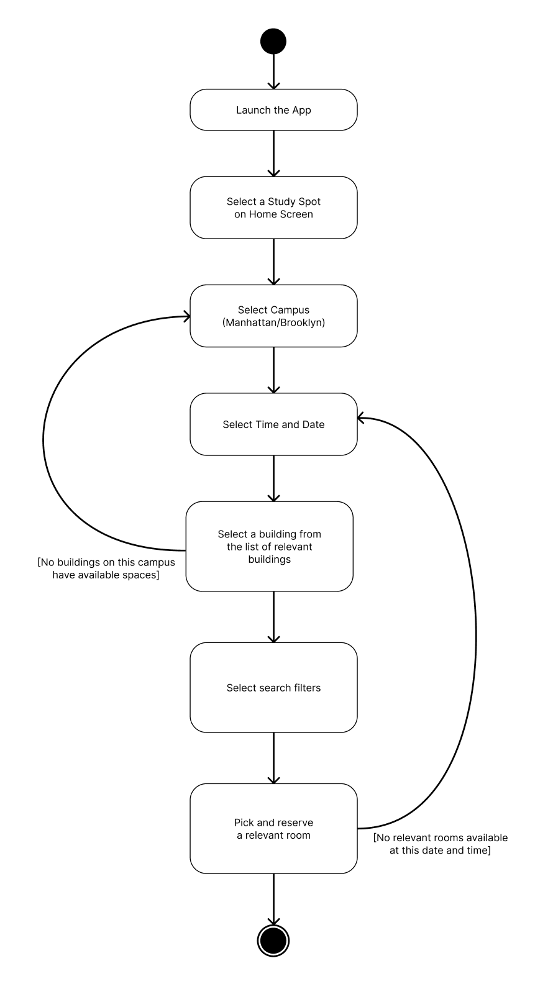

# Specification Phase Exercise

A little exercise to get started with the specification phase of the software development lifecycle. See the [instructions](instructions.md) for more detail.

## Team members

See instructions. Delete this line and replace with a list of the names of your team members, including links to each one's GitHub profile.
Maya Felix - https://github.com/mxf4596
Nicholas Michael - https://github.com/NMichael111
Vladimir Kartamyshev - https://github.com/lawaldemur
Giulia Carvalho - https://github.com/giulia-carvalho

## Stakeholders

Goals/Needs:
Know when rooms are available/occupied in advance
Be able to reserve rooms in advance
Know what spaces are for quiet study or open discussion
Sometimes you need to charge your devices while on campus

Frustrations/Problems:
It is hard to find quiet spaces on campus
some people live far from campus and need a place to be in between their classes
hard to coordinate back-to-back events
it is hard to find spots for clubs to have meetings/events

Have you ever avoided reserving a room on campus because it was inconvenient?

Sam: “My freshman year I didn’t even know you could reserve rooms. But even after I found out, I still didn’t really bother.”
Andy: “After going to a bunch of different spots on campus I kind of figured out which ones are the least crowded and go there because I don’t want to deal with reserving or checking anything. But it would be nice to be able to go to the other spots.”

Have you ever been in a position where you need a private space for studying?

Sam: “I have a roommate so pretty much all the time.”
Andy: “Yeah. I have a lot of projects that require working with other people and it’s hard to do that in many places because you need to talk.”

Have you ever been to Bobst and there were no rooms available?

Sam: “During midterms and finals, it’s impossible to find anywhere to work.”
Andy: “So many times”

Have you ever wanted to know how crowded your study spot is?

Sam: “Yeah. It would be really nice to know how crowded the places are before going all the way there”
Andy: “I usually just assume its full”

## Product Vision Statement

A mobile app letting students know what spaces are available and helping to reserve them.

## User Requirements

As a commuter nyu student, I want to be able to find all the spaces I can eat lunch in in between classes so that I can eat lunch on campus

As a commuter student at nyu, I want to be able to find all the quiet spaces I can study in between classes so that I don’t have to go back home

As an nyu student club president, I want to be able to find more open rooms where my club can host events

as an nyu student club president, I want better access to rooms so I can have more flexibility for the times where my club can host events 

As a commuter nyu student I want to find more places so I can stay on campus more to make it easier to meet other people

As an NYU senior, I want to be able to coordinate my schedule with my job interviews, optimizing time and location in advance.

As a student taking midterms, I want to be able to keep track of seat/room availability before I arrive. 

As an NYU student I want to ensure that there is always a spot for me to study.

As an NYU Computer Science student, I want to know where I can charge my devices on campus.

As an nyu student, I want variety in my study spots so that it is less boring

As an nyu student, I want to be able to find spots where I can work with other people on group projects

As an nyu student, I want a space away from my roommate to study

## Activity Diagrams

"As a student taking midterms, I want to be able to keep track of seat/room availability before I arrive"
    

"As an NYU Student Club President, I want better access to rooms so I can have more flexibility for the times where my club can host events"
    

## Clickable Prototype

See instructions. Delete this line and place a publicly-accessible link to your clickable prototype here.
